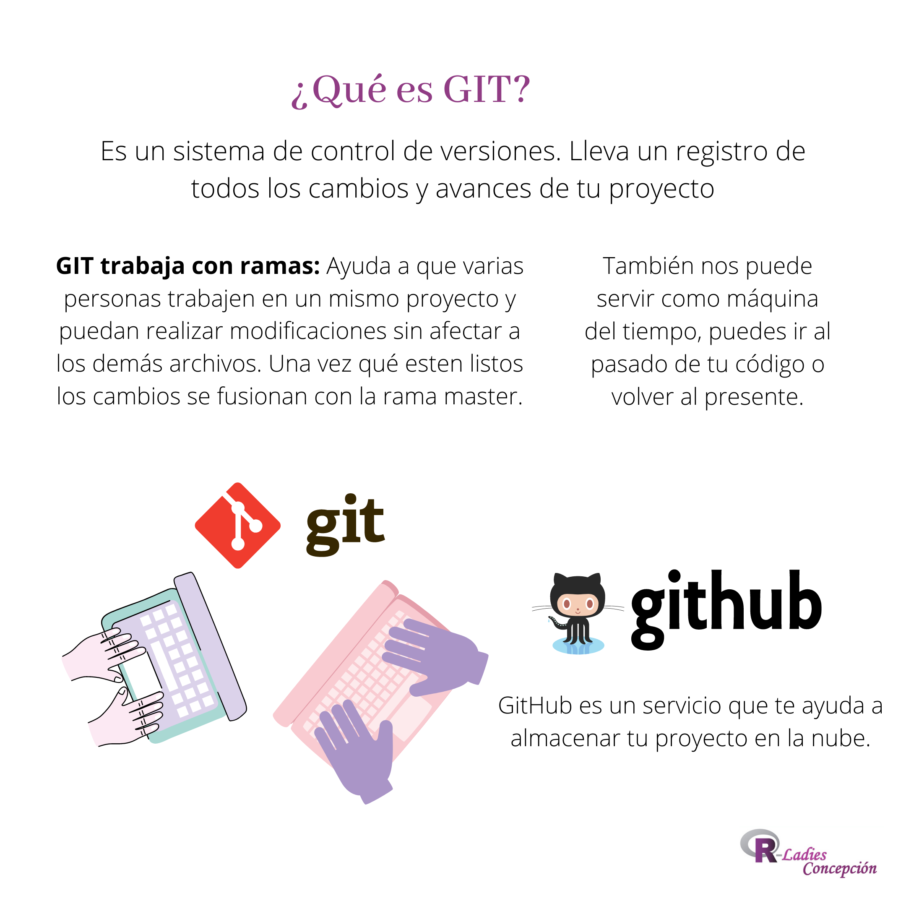
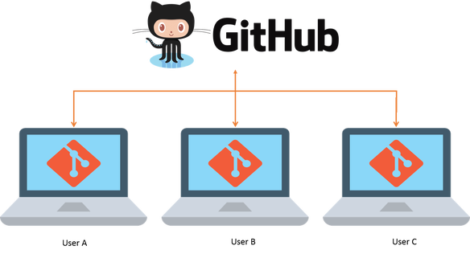

class: inverse

background-image: url(https://happygitwithr.com/img/watch-me-diff-watch-me-rebase-smaller.png)
background-position: 90% 30%
background-size: 40%

</br>
</br>
#Happy Git with R

##Club de lectura</br>RLadies Chile </br> Sesión 5
</br>
#### Camila Molina [`r icon::fa("twitter")` @calmolinafe](https://https://twitter.com/calmolinafe)

#### Gabriela Sandoval [`r icon::fa("twitter")` @GabySandovalM](https://twitter.com/GabySandovalM)


#### 08 - julio - 2020


---

<center>

---
# Hoy veremos

###VI Daily Workflows "https://happygitwithr.com"

###Capítulos:

* 26 The Repeated Amend
* 27 Dealing with push rejection
* 28 Pull, but you have local work
* 29 Time travel: See the past
* 30 Fork and clone
* 31 Get upstream changes for a fork
* 32 Explore and extend a pull request
* 33 Make a GitHub repo browsable

---
# Sección VI 

###Patrones útiles de Git para la vida real

* Comprometerse temprano y con frecuencia. Empuje con menos frecuencia.

* Ayuda, mi empuje fue rechazado.

* Integrando trabajo remoto y local.

* Quemalo todo.

* Viaje en el tiempo:

 * "Solo necesito ver el pasado"
 * "Necesito visitar el pasado"
 * "Quiero volver al pasado" `git revert`, `git reset`
 * "Tuve una gran galleta en octubre pasado" `git cherry pick`, `git checkout REF -- path`

---
class: inverse, middle

# Capítulo 26


<center>

**¡Siempre puedes volver a una versión más feliz de tu proyecto!**

---

<center>

---

###26.1 Analogía de escalada en roca

<center>


**Consejo:** Usa más commits cuando estás en territorio incierto o peligroso.

---

###26.2 Boceto de flujo de trabajo

####26.2.1 Condición inicial

* Paquete R? Ejecute sus pruebas o `R CMD check`.
* ¿Análisis de los datos? Vuelve a ejecutar su secuencia de comandos o vuelva a procesar su `.Rmd` con el nuevo fragmento.
* ¿Sitio web o libro? Asegúrese de que el proyecto aún se compila.
* Tienes la idea.

Asegúrese de que su "árbol de trabajo esté limpio" y que esté sincronizado con su control remoto GitHub. `git status` debería mostrar algo como:


```{r eval=FALSE}
On branch master
Your branch is up to date with 'origin/master'.

nothing to commit, working tree clean
```
---

####26.2.2 Ponerse a trabajar

Imagina que comenzamos en commit C, con commit B anterior y, antes de eso, A:

```{r eval=FALSE}
... -- A -- B -- C
```

Da un pequeño paso hacia tu objetivo. Vuelva a verificar que su proyecto funcione.

Organice esos cambios y comprométase con el mensaje "WIP", que significa "trabajo en progreso".

```{r eval=FALSE}
git commit -m "WIP"
```

El mensaje puede ser cualquier cosa, pero "WIP" es una convención común.

Su historia ahora se ve así:

```{r eval=FALSE}
A -- B -- C -- WIP*
```

**¡No empujes!** El * anterior significa una confirmación que existe solo en su repositorio local, no todavía en GitHub.

Vuelva a verificar si su proyecto aún funciona.

---
```{r eval=FALSE}
git commit --amend --no edit
```

La `--no-edit` retiene el mensaje de confirmación actual de "WIP".

**¡No empujes!** Su historia ahora se ve así:

```{r eval=FALSE}
A -- B -- C -- WIP*
```

Pero los cambios asociados con la confirmación `WIP*` ahora representan sus dos últimas confirmaciones, es decir, todos los cambios acumulados desde el estado C. 

Digamos que finalmente has logrado tu objetivo.

Una última vez, verifique que su proyecto funcione y que esté dispuesto a compartirlo con otros.

Comprometerse, enmendar nuevamente, pero con un mensaje de compromiso real esta vez. Piense en esto como commit D. Push. Haga esto en RStudio o en el shell:

```{r eval=FALSE}
git commit --amend -m "Implement awesome feature; closes #43"
git push
```

Su historia en GitHub, se ve así:

```{r eval=FALSE}
A -- B -- C -- D
```

---

###26.3 ¿Qué sucede si necesito retroceder?

Imagina que estás en medio de un flujo de trabajo de modificación repetido:

```{r eval=FALSE}
A -- B -- C -- WIP*
```

y realiza algunos cambios que rompen su proyecto. Estos malos cambios aún no se han comprometido, pero se guardan. Desea volver al último buen estado, representado por `WIP*`.

En Git, desea hacer un restablecimiento completo al estado `WIP*`.

```{r eval=FALSE}
git reset --hard
```

que es implícitamente lo mismo que

```{r eval=FALSE}
git reset --hard HEAD
```

que dice: "restablecer mis archivos a su estado en la confirmación más reciente".

---

###26.4 ¿Por qué no impulsamos el progreso intermedio?

La modificación de un commit es un ejemplo de lo que se llama *"reescribir el historial de Git"*.

Reescribir la historia que ya ha sido enviada a GitHub y, por lo tanto, potencialmente extraída por otra persona, es una práctica controvertida.

Una vez que haya empujado algo, considérelo escrito en piedra y siga adelante.

---

###26.5 Um, ¿y si empujé?

¡Te dije que no lo hicieras!

Imaginemos que empujó este estado a GitHub por error:

```{r eval=FALSE}
A -- B -- C -- WIP (85bf30a)
```

y procedió `git commit --amend` nuevamente a nivel local, llevando a este estado:

```{r eval=FALSE}
A -- B -- C -- WIP* (6e884e6)
```

Tienes dos opciones:

* Restablezca su repositorio local a C (`git reset --hard HEAD^`)

```{r eval=FALSE}
A -- B -- C -- WIP (85bf30a)
```

* Forzar empuje a Github (`git push --force`)

```{r eval=FALSE}
A -- B -- C -- WIP* (6e884e6)
```

Ahora estás sincronizado de nuevo.

---

class: inverse, middle

# Capítulo 27

###Manejo del rechazo de empuje

**Problema:** desea enviar cambios a GitHub, pero es rechazado así:

```{r eval=FALSE}
$ git push
To https://github.com/YOU/REPO.git
 ! [rejected]        master -> master (fetch first)
error: failed to push some refs to 'https://github.com/YOU/REPO.git'
hint: Updates were rejected because the remote contains work that you do
hint: not have locally. This is usually caused by another repository pushing
hint: to the same ref. You may want to first integrate the remote changes
hint: (e.g., 'git pull ...') before pushing again.
hint: See the 'Note about fast-forwards' in 'git push --help' for details.
```

---

Le sugiero que use `git status` o visite su GitHub en el navegador para obtener más información sobre la situación.

En resumen, este es el estado en GitHub

```{r eval=FALSE}
A -- B -- C (on GitHub)
```

Y este es tu estado local:

```{r eval=FALSE}
A -- B -- D (what you have)
```

No puede hacer que se produzca algún tipo de fusión en la copia de GitHub cuando presiona.

---
###27.1 ¡La que empuja primero gana!

Es posible que haya notado que usted, el autor de D, está jugando con Git más que la persona que se comprometió y empujó C, es decir, su colaborador.

<center> 

---

###27.2 Mantente en contacto

En general, vale la pena ser proactivamente consciente de lo que otros están haciendo que estar siempre en modo reactivo, aprendiendo sobre el trabajo de su colaborador solo cuando su empuje es rechazado.

<center>

---

###27.3 Usar ramas

Finalmente, sus primeras experiencias colaborando con otros y con usted mismo `master` le darán una comprensión visceral de por qué la mayoría de los usuarios de Git eventualmente comienzan a usar ramas.

<center>

---

class: inverse, middle

# Capítulo 28

###Pull, pero tienes trabajo local

**Problema:** desea extraer los cambios desde el nivel superior, pero ha realizado un nuevo trabajo localmente desde la última vez que lo hizo.

---

###28.1 El trabajo local no está comprometido

El estado remoto es `A--B--C`.
El estado local es `A--B--(uncommitted changes)`.

####28.1.1 Casos simples felices

Hay dos escenarios felices, en los que `git pull` simplemente funcionará:

* Ha introducido archivos completamente nuevos que no existen en la rama remota.
* Los archivos afectados por su trabajo local tienen CERO superposición con los archivos afectados.

Resumen de estos `git pull` escenarios felices:

```{r eval=FALSE}
                 Remote: A--B--C

Local before 'git pull': A--B--(uncommitted changes)
 Local after 'git pull': A--B--C--(uncommitted changes)
```

---

####28.1.2 `git stash` funciona, a veces

Si sus cambios afectan un archivo (`foo.R` en el ejemplo a continuación) que también se ha cambiado en commit `C`, no puede hacerlo `git pull`. No hace daño intentarlo, pero fracasarás y se verá más o menos así:

```{r eval=FALSE}
jenny@2015-mbp ethel $ git pull
remote: Enumerating objects: 5, done.
remote: Counting objects: 100% (5/5), done.
remote: Compressing objects: 100% (2/2), done.
remote: Total 3 (delta 1), reused 1 (delta 0), pack-reused 0
Unpacking objects: 100% (3/3), done.
From github.com:jennybc/ethel
   db046b4..2d33a6f  master     -> origin/master
Updating db046b4..2d33a6f
error: Your local changes to the following files would be overwritten by merge:
        foo.R
Please commit your changes or stash them before you merge.
Aborting
```
---

###28.2 El trabajo local está comprometido

El estado remoto es `A--B--C`.
El estado local es `A--B--D`.

####28.2.1 Pull (buscar y fusionar)

La opción más simple es buscar los commits desde flujo ascendente y fusionarlos, que es lo que `git pull` hace. 

Aquí está el mejor caso, la versión sin conflictos de fusión de `git pull`:

```{r eval=FALSE}
jenny@2015-mbp ethel $ git pull

< YOU WILL PROBABLY BE KICKED INTO AN EDITOR HERE RE: MERGE COMMIT MESSAGE! >

Merge made by the 'recursive' strategy.
 README.md | 4 ++--
 1 file changed, 2 insertions(+), 2 deletions(-)
```

---

###28.3 Otros enfoques

####Usar una rama temporal para el trabajo local

Cree una nueva rama temporal y confirme allí los cambios no confirmados. Checkout `master` y `git pull` para obtener cambios upstream. Ahora necesita recuperar el trabajo del commit en la rama temporal. Opciones:

* Combinar la rama temporal en `master`.
* Cherry elige el commit de la rama temporal en `master`.

---

###28.4 Algunos trabajos locales están comprometidos, otros no

Esta es una situación incómoda que se puede manejar con una combinación de estrategias vistas anteriormente: hacer un compromiso pragmático `master` o una rama temporal.
---

class: inverse, middle

# Capítulo 29

###Viaje en el tiempo: ver el pasado

Ejemplos:

* "Me gustó más la combinación de colores de esta trama en el borrador de la semana pasada". "¿Qué pasa con ese nuevo atípico funky en la figura 2?"

 * Aquí querrá visitar los scripts y los datos de origen, ya que fueron la última vez que generó visualizaciones para compartir con este colega.
 
 
* "La compilación ha fallado en Windows durante dos semanas".

 * Aquí querrá inspeccionar la fuente del paquete en la versión del "último bien conocido" y examinar las confirmaciones posteriores.

---

###29.1 ¡Los hipervínculos son increíbles!

Aquí es donde realmente brillan GitHub (y GitLab o BitBucket). La capacidad de explorar rápidamente diferentes confirmaciones/estados, cambiar entre ramas, inspeccionar archivos individuales y ver la discusión en temas vinculados es increíblemente poderosa.

<center>

---

###29.2 Examinar el historial de confirmaciones y las confirmaciones específicas

Desde la página de destino de su repositorio, acceda al historial de confirmaciones haciendo clic en "confirmaciones xyz". Esto es como usarlo git loglocalmente, pero mucho más gratificante. Si tiene un buen cliente local de Git , probablemente también proporcione una descripción gráfica del historial.

<center>

---

Una vez que esté viendo el historial, observe tres formas de acceder a más información para cada confirmación:

* El icono del portapapeles copia el SHA-1 de la confirmación. Esto puede ser útil si necesita referirse a esta confirmación en otro lugar, por ejemplo, en un hilo de problema o un mensaje de confirmación o en un comando Git que está formando para la ejecución local.

* Haga clic en el SHA-1 abreviado para ver la diferencia asociada con la confirmación.

* Haga clic en los corchetes de doble ángulo `<>` para explorar el estado de todo el repositorio en ese punto de la historia.

<center>

---

###29.3 Consultas basadas en archivos

¿Qué pasa si está interesado en cómo un archivo específico llegó a ser como es? Primero navegue hasta el archivo, luego observe "Culpa" e "Historial" en la esquina superior derecha.

<center>

---

###29.4 Búsqueda

La búsqueda siempre está disponible en la esquina superior derecha de GitHub.

<center>

---


---
class: inverse, middle

Profundicemos sobre los repositorios remotos:

# Capítulo 30 - Fork and clone

### Obtener una copia de un repositorio (de alguien más) y talvez sugerir cambios.


---
background-image: url(imagenes/30flujo.png)
background-position: 50% 99%
background-size: auto

# Flujo inicial:

Copiar el repositorio de interés en mi GitHub:

---
background-image: url(imagenes/30flujo1.png)
background-position: 50% 99%
background-size: 90% 90%

### Tengo REPO en mi GitHub, ahora quiero tener los archivos en mi computador (copia local) para usarlos: 

---
class: middle

Para hacer el fork también podemos usar el paquete `usethis`

```{r eval = FALSE}
usethis::create_from_github()
```


```{r eval = FALSE}
usethis::create_from_github("Owner/REPO",
                            destdir = "~/ruta")
```

Requiere que se haya configurado un token de acceso personal de GitHub.

---
class: middle, center
## Ya tenemos el código en nuestro computador... 

##!A usarlo!

---
background-image: url(imagenes/30nombres.png)
background-position: 50% 99%
background-size: auto

Recordemos los nombres (por convención) que tienen los repositorios:

---
background-image: url(imagenes/30conexion.png)
background-position: 50% 100%
background-size: 80%


#### Desde mi compia **local** puedo enviar cambios al **origin** (copia en GitHub)

.center[**push**]

#### Desde el **origin** puedo pedir que el **upstream** (repositorio original) sea modificado

.center[**pull request**]


---
class: inverse, middle

Tengo una copia de un repositorio, pero su propietario lo actualizó...

# Cap 31 - Get upstream changes for a fork

### Traer los cambios a mi copia del repositorio.

---
class: middle

####GitHub NO mantiene sincronizados a:
.center[
Owner/REPO  

You/REPO
]

**Solución: ** 

> Agregar al **upstream** como un segundo repositorio remoto


** Recomendación:**

> Hacer el fork, clonar y luego declarar el upstream como un segundo repositorio remoto.

---
background-image: url(imagenes/31master.png)
background-position: 50% 15%
background-size: 80%

Recuerda que ahora estamos trabajando en la copia local de (You/REPO).

### Antes de agregar upstream como remoto:

* Verifica que la rama activa sea master, es decir, desde: REPO/master

</br>
</br>
</br>
</br>


* Verifica que todo este en orden: 

.center[
```{markdown}
git status
```
]

Debe aparecer un mensaje como este:

```{markdown}

On branch master 
    Your branch is up to date with 'origin/master'.`

    nothing to commit, working tree clean

```

---

### Agregar el upstream como repositorio remoto

Revisar los repositorio remotos actuales:

```{markdown}
git remote -v
```

Agregar `Owner/REPO` como upstream remoto:

```{markdown}
git remote add upstream http://github.com/Owner/REPO.git 
```

Verificar que está agregado como upstream:

```{markdown}
git remote -v
```

Luego de la última línea deberiamos ver algo así:
```{markdown}
origin    https://github.com/You/REPO.git (fetch)
origin    https://github.com/You/REPO.git (push)
upstream  https://github.com/Owner/REPO.git (fetch)
upstream  https://github.com/Owner/REPO.git (push)
```

---
background-image: url(imagenes/31conexion.png)
background-position: 50% 80%
background-size: 70%

### Actualizar, en mi copia local, los cambios que hizo `OWNER`.

```{markdown}
git pull upstream master --ff-only
```

.center[
"Traiga (pull) los cambios desde el remoto upstream en la rama master de mi repositorio local"]


---
class: middle
### ¡Ya todo está conectado!

### Recomendación:

> En este caso (repositorio local producto de fork y clone) no hacer commits desde la rama master, es mejor trabajar desde una nueva rama.

.center[
###**Trabajar en una nueva rama**
]

Para crear una nueva rama:
```{markdown}
git branch nombre 
```

Para cerrar la rama (volmemos a master):

```{markdown}
git branch nombre 
git checkout nombre
```

---
class: middle
### Hice commit desde la rama master...
### ¿Qué hacer?

Tenemos algo así:

* `Owner/REPO`: 

.center[`... -- A -- B -- C -- D -- E -- F`]

* La rama `master` en mi copia local:

.center[`... -- A -- B -- C -- X -- Y -- Z`]

**¿Por qué esto es un problema?**

---
class: middle

Hay dos opciones:

1. Si **quiero conservar** mis cambios: crear una nueva rama para guardar ahi mis cambios.

Para crear la rama y cerrarla usamos: 
.center[`git checkout -b mis-cambios`]
Luego cierro también la rama master:
.center[`git checkout master`]

2. Si **no quiero conservar** mis cambios: reiniciamos la rama master a un punto. 
.center[`git reset --hard C`]

---
class: inverse, middle

En el caso en que soy mantenedor/a de un paquete: 


# Capítulo 32 - Explore and extend a pull request - PR

### Recibir un PR y dar sugerencias de cambios en el PR.

---
class: middle
### Situación:

* Eres el mantenedor de un paquete de R en GitHub.

* Recibes pull request PR de colaboradores externos.

* Necesitas experimentar con el PR para dar retroalimentación o antes de aceptar los cambios propuestos.

* Queremos dar crédito a los colaboradores por sus commits.

### Terminología:

* **fork branch:** rama de un fork desde la que se hizo un PR.
* **local branch:** rama local que se usa para trabajar con el PR.
* **PR parent:** El SHA del commit en el repositorio principal que es la base para el PR.
* **PR remote:** El SSH o HTTPS URL para el fork desde el que se hizo el PR.

---
class: middle

En esta sección del libro se presentan 3 consejos oficiales de GitHub para la situación antes descrita. Aquí una idea resumen de las 3 versiones:

* **Versión 1:** Hacer **pull** desde la **fork branch** del **PR remote**, para luego hacer las revisiones necesarias. Finalmente, hacer **push** y **merge** cuando todo esta ok.
</br> </br> Problema: En **parent commit** de la **local branch** no será el **parent commit** de la **PR branch**. (Podría no ser evidente quien hizo la contribución).

* **Versión 2:** Sigue la idea de la versión 1 y además considera un **pull request inactivo** (quien hizo el pull request no responde o elimino el fork).

* **Versión 3:** El mantenedor puede **empujar** nuevos commits al PR empujando commits a un fork (el mantenedor puede hacer push a la rama de un fork asociada a un PR).

En una nueva propuesta (aun en desarrollo) la autora propone un flujo de trabajo que combina las 3 anteriores con algunos ajustes y usando la librería `git2r`.

---
class: inverse, middle


Hagamos que el repositorio sea fácil de leer.


# Capítulo 33 - Make a GitHub repo browsable

### Prácticas para una navegación gratificante en su repositorio

---
class: middle

###Sé inteligente sobre los archivos
- Archivos en forma simple.
- Texto plano es lo mejor.

###¿Hacer o no commit de productos derivados?
- Por ejemplo: .Rmd --> .md --> .html
- Algunos dirán que si, otros que no.
- "Que podamos hacer todo desde cero no significa que queremos hacerlo".


---
### Cosas interesantes que puede hacer GitHub con varios tipos de archivos:

### Markdown
- Es un buen formato predeterminado para archivos de texto narrativo.
- guía para aprevechar [Markdown en GitHub](https://guides.github.com/features/mastering-markdown/#GitHub-flavored-markdown)

### RMarkdown
- Podemos obtener el markdown `.md` intermedio.

```{r eval = FALSE}
---
output:
  html_document:
    keep_md: TRUE
---
```

- Hacer commit del `.Rmd` y del `.md`.


---
class: middle

- Otra opcion es usar un `github document`

```{r eval = FALSE}
---
output: github_document
---
```

* También podemos explorar los [Gist](https://gist.github.com/) cuando queremos crear un documento rápido que no encaja en un repositorio.

### README.md

* Es la pagina de destino de un repositorio.
* Un subdirectorio dentro de un repositorio puede tener su propio `README.md`. [Ver](https://github.com/jennybc/gapminder/tree/master/data-raw#readme)
* Algunos repositorios son solo un `README.md`. [Ver](https://github.com/jennybc/orly-full-res#readme)


---
class: middle

### Encontrar cosas
- En un repositorio presiona t (se abre un buscador de archivos).
- Cuando esté viendo un archivo específico presione y (obtedrá un link permanente).


### Html
- Un archivo .html no tiene una vista sin formato.
- Podemos generar un preview con: [vista previa de HTML de GitHub y BitBucket](https://htmlpreview.github.io/)

### Archivos delimitado

- GitHub proporciona una buena representación de archivos `.csv` y `.tsv`. [Ver](https://github.com/MinCiencia/Datos-COVID19)


---
class: middle
### PNG 
- Se prefiere (por ahora) el formato PNG.
- PNG es el formato "sin complicaciones" en el que se almacenan figuras para la web.


### Descargar como .zip

- Si agrega `/archive/master.zip` al final de la URL de su repositorio, construye un enlace que descargará un archivo ZIP de su repositorio.

- Ya puedes compartir el link `https://github.com/usuario/repositorio/archive/master.zip`

---
class:middle
# Referencias:

* Las imágenes presentadas en los cap 30 y 31 son modificaciones de las presentadas en el libro Happy Git with R.

* Esta presentación se realizó con el paquete [`Xaringan`](https://cran.r-project.org/web/packages/xaringan/index.html) usando el theme `rladies`.


---
class: inverse center middle
##¡Gracias por venir hoy!##


